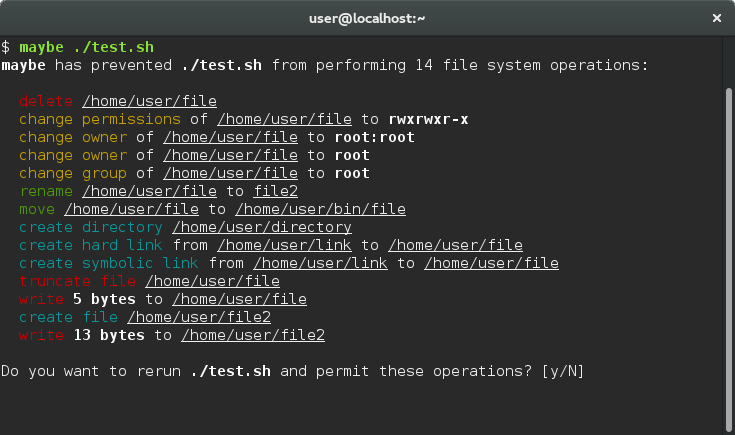

<table>
  <tr>
    <td><strong>Package</strong></td>
    <td>
      <a href="https://pypi.python.org/pypi/maybe">
        
      </a>
      
      
    </td>
  </tr>
  <tr>
    <td><strong>Tests</strong></td>
    <td>
      <a href="https://travis-ci.org/p-e-w/maybe">
        
      </a>
      <a href="https://coveralls.io/github/p-e-w/maybe?branch=master">
        
      </a>
      <a href="https://gemnasium.com/github.com/p-e-w/maybe">
        
      </a>
    </td>
  </tr>
</table>


---


```
rm -rf pic*
```

Are you sure? Are you *one hundred percent* sure?


# `maybe`...

... allows you to run a command and see what it does to your files *without actually doing it!* After reviewing the operations listed, you can then decide whether you really want these things to happen or not.




## What is this sorcery?!?

`maybe` runs processes under the control of [ptrace](https://en.wikipedia.org/wiki/Ptrace) (with the help of the excellent [python-ptrace](https://github.com/haypo/python-ptrace) library). When it intercepts a system call that is about to make changes to the file system, it logs that call, and then modifies CPU registers to both redirect the call to an invalid syscall ID (effectively turning it into a no-op) and set the return value of that no-op call to one indicating success of the original call.

As a result, the process believes that everything it is trying to do is actually happening, when in reality nothing is.

That being said, `maybe` **should :warning: NEVER :warning: be used to run untrusted code** on a system you care about! A process running under `maybe` can still do serious damage to your system because only a handful of syscalls are blocked. It can also check whether an operation such as deleting a file succeeded using read-only syscalls, and *alter its behavior accordingly.* Therefore, a rerun without restrictions is not guaranteed to always produce the displayed operations.

Currently, `maybe` is best thought of as an (alpha-quality) "what exactly will this command I typed myself do?" tool.


## Installation

`maybe` runs on Linux :penguin: and requires [Python](https://www.python.org/) 2.7+/3.3+ :snake:. If you have the [pip](https://pip.pypa.io) package manager, all you need to do is run

```
pip install maybe
```

either as a superuser or from a [virtualenv](https://virtualenv.pypa.io) environment. To develop `maybe`, clone the repository and run

```
pip install -e .
```

in its main directory to install the package in editable mode.


## Usage

```
maybe [options] command [argument ...]
```

### Positional arguments

| Argument | Description |
| --- | --- |
| `command` | the command to run under `maybe`'s control |
| `argument ...` | argument(s) to pass to `command` |

### Optional arguments

| Argument | Description |
| --- | --- |
| `-a OPERATION ...`,<br>`--allow OPERATION ...`<br>&nbsp;&nbsp;&nbsp;&nbsp;&nbsp;&nbsp;&nbsp;&nbsp;&nbsp;&nbsp;&nbsp;&nbsp;&nbsp;&nbsp;&nbsp;&nbsp;&nbsp;&nbsp;&nbsp;&nbsp;&nbsp;&nbsp;&nbsp;&nbsp;&nbsp;&nbsp;&nbsp;&nbsp;&nbsp;&nbsp;&nbsp;&nbsp;&nbsp;&nbsp;&nbsp;&nbsp;&nbsp;&nbsp;&nbsp;&nbsp;&nbsp;&nbsp;&nbsp;&nbsp;&nbsp; | allow the command to perform the specified operation(s). all other operations will be denied. possible values for `OPERATION` are: `change_owner`, `change_permissions`, `create_directory`, `create_link`, `create_write_file`, `delete`, `move`; as well as any filter scopes defined by loaded plugins |
| `-d OPERATION ...`,<br>`--deny OPERATION ...` | deny the command the specified operation(s). all other operations will be allowed. see `--allow` for a list of possible values for `OPERATION`. `--allow` and `--deny` cannot be combined |
| `-p FILE ...`,<br>`--plugin FILE ...` | load the specified [plugin](#plugin-api) script(s) |
| `-l`, `--list-only` | list operations without header, indentation and rerun prompt |
| `--style-output {yes,no,auto}` | colorize output using ANSI escape sequences (`yes`/`no`) or automatically decide based on whether stdout is a terminal (`auto`, default) |
| `-v`, `--verbose` | if specified once, print every filtered syscall. if specified twice, print every syscall, highlighting filtered syscalls |
| `--version` | show program's version number and exit |
| `-h`, `--help` | show a help message and exit |


## Plugin API

By default, `maybe` intercepts and blocks all syscalls that can make permanent modifications to the system. For more specialized syscall filtering needs, `maybe` provides a simple yet powerful plugin API. Filter plugins are written in pure Python and use the same interfaces as [`maybe`'s built-in filters](maybe/filters).

The public API is composed of the following two members:

#### *maybe.*`T`

A [Blessings](https://github.com/erikrose/blessings) `Terminal` object that can be used to format console output (such as `operation` as documented below). Output formatted with this object automatically complies with the `--style-output` command line argument.

#### *maybe.*`register_filter(syscall, filter_function, filter_scope=None)`

Add the filter `filter_function` to the filter registry. If the filter is enabled (which is the default, but can be altered with the `--allow` and `--deny` command line arguments), it intercepts all calls to `syscall` made by the controlled process. `filter_scope` determines the key to be used in conjunction with `--allow` and `--deny` to enable/disable the filter (multiple filters can share the same key). If `filter_scope` is omitted or `None`, the last part of the plugin's module name is used.

`filter_function` itself must conform to the signature `filter_function(process, args)`. `process` is a [`Process`](maybe/process.py) control object that can be used to inspect and manipulate the process, while `args` is the list of arguments passed to the syscall in the order in which they appear in the syscall's signature. If an argument represents a (pointer to a) filename, the argument will be of type `str` and contain the filename, otherwise it will be of type `int` and contain the numerical value of the argument.

When called, `filter_function` must return a tuple `(operation, return_value)`. `operation` can either be a string description of the operation that was prevented by the filter, to be printed after the process terminates, or `None`, in which case nothing will be printed. `return_value` can either be a numerical value, in which case the syscall invocation will be prevented and the return value received by the caller will be set to that value, or `None`, in which case the invocation will be allowed to proceed as normal.

### Example

Here, `maybe`'s plugin API is used to implement an exotic type of access control: Restricting read access based on the *content* of the file in question. If a file being opened for reading contains the word **SECRET**, the plugin blocks the `open`/`openat` syscall and returns an error.

#### `read_secret_file.py`

```python
from os import O_WRONLY
from os.path import isfile
from maybe import T, register_filter

def filter_open(path, flags):
    if path.startswith("/home/") and isfile(path) and not (flags & O_WRONLY):
        with open(path, "r") as f:
            if "SECRET" in f.read():
                return "%s %s" % (T.red("read secret file"), T.underline(path)), -1
            else:
                return None, None
    else:
        return None, None

register_filter("open", lambda process, args:
                filter_open(process.full_path(args[0]), args[1]))
register_filter("openat", lambda process, args:
                filter_open(process.full_path(args[1], args[0]), args[2]))
```

Indeed, the plugin works as expected:

```
[user@localhost]$ maybe --plugin read_secret_file.py --deny read_secret_file -- bash
$ echo "This is a normal file." > file_1
$ echo "This is a SECRET file." > file_2
$ cat file_1
This is a normal file.
$ cat file_2
cat: file_2: Operation not permitted
```


## License

Copyright &copy; 2016-2017 Philipp Emanuel Weidmann (<pew@worldwidemann.com>)

Released under the terms of the [GNU General Public License, version 3](https://gnu.org/licenses/gpl.html)
